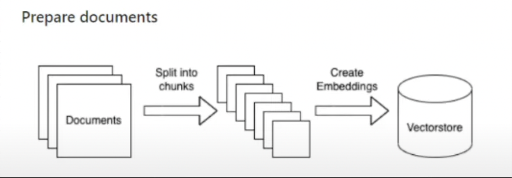
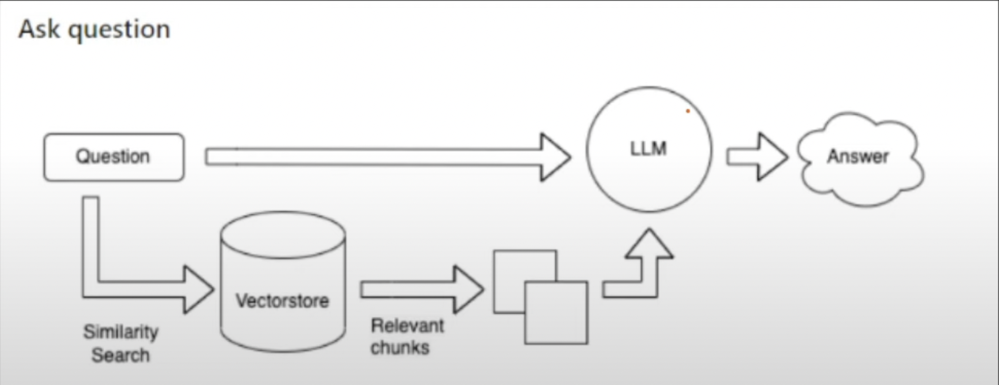

# DocQuery AI (RAG with AWS-Bedrock)

DocQuery AI is an advanced Retrieval-Augmented Generation (RAG) application that combines the power of AWS Bedrock, LangChain, and state-of-the-art LLMs like Claude and LLaMA2 to deliver efficient document-based querying. This app simplifies PDF ingestion, implements scalable vector storage, and facilitates seamless knowledge extraction.

## Overview

DocQuery AI leverages AWS Bedrock for scalable cloud computing, Titan embeddings for embedding generation, and FAISS for similarity search. By integrating LangChain with powerful language models, the system provides accurate and contextually relevant answers to user queries based on PDF documents.

### Architecture

1. **Document Preparation**

   Uploaded documents are processed by splitting them into manageable chunks and generating embeddings, which are stored in a vector database for efficient similarity search.

   

2. **Query Processing**

   Queries are matched against stored embeddings through similarity search, relevant chunks are retrieved, and answers are generated using LLMs.

   

## Features

- **PDF Ingestion**: Upload PDF files to extract and index content into the vector store.
- **Efficient Query Matching**: Uses FAISS vector store for fast and accurate similarity search.
- **LLM Integration**: Combines the power of Claude and LLaMA2 for intelligent Q&A.
- **AWS Scalability**: Deployed on AWS infrastructure, ensuring robust performance and scalability.
- **Dynamic Vector Store Updates**: Easily update vector embeddings for real-time query enhancements.
